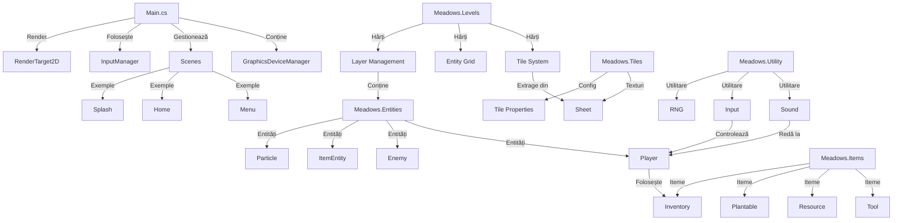

Iată schema completă a proiectului **Meadows**, structurată pe module și interacțiuni cheie:



### **Explicații pe module**:

1. **`Main.cs`**  
   - **Rol**: Motorul principal (game loop, scalare grafică, manager de scene).  
   - **Interacțiuni**:  
     - Folosește `InputManager` pentru input.  
     - Gestionează tranziții între scene (`Menu`, `Home` etc.).  
     - Renderizează pe un `RenderTarget2D` pentru scalare adaptivă.

2. **`Meadows.Entities`**  
   - **Componente**:  
     - `Player`: Logica jucătorului (mișcare, inventar).  
     - `Bush`/`Plant`: Entități interactive.  
     - `Particle`: Efecte vizuale.  
   - **Legături**:  
     - Folosesc `Inventory` din `Meadows.Items`.  
     - Actualizate de `Level.Update()`.

3. **`Meadows.Items`**  
   - **Sistemul de Iteme**:  
     - `Tool`: Unelte (ex: sickle).  
     - `Plantable`: Resurse plantabile (ex: cartofi).  
     - `Inventory`: Stocare și afișare iteme.  
   - **Conexiuni**:  
     - `Player` interacționează cu `Inventory`.  
     - `ResourceItem` apare în `Level` când sunt recoltate plante.

4. **`Meadows.Levels`**  
   - **Management Hărți**:  
     - `Layer`: Straturi de tile-uri (CSV → Tile[]).  
     - `Entity Grid`: Optimizare pentru coliziuni.  
   - **Dependințe**:  
     - Folosește `Sheet` din `Meadows.Tiles` pentru texturi.

5. **`Meadows.Tiles`**  
   - **Rol**:  
     - `Sheet`: Încarcă și decupează sprite sheets.  
     - `Tile`: Proprietăți (passable, swimmable) + animații.  
   - **Exemplu**:  
     - `Sheets.Water` pentru animații de apă.

6. **`Meadows.Utility`**  
   - **Utilitare**:  
     - `Sound`: Pooling de sunete (ex: `Collect.wav`).  
     - `InputManager`: Stări tastatură/mouse.  
     - `RNG`: Randomizare (folosit în entități).

---

### **Fluxuri Cheie**:
1. **Jucătorul interacționează cu un copac**:  
   ```mermaid
   flowchart LR
       A[Player.Hurt] --> B[Tree.Hurt]
       B --> C[Drop ResourceItem]
       C --> D[Inventory.Add]
   ```

2. **Încărcare nivel**:  
   ```mermaid
   flowchart LR
       A[Level.Layer] --> B[Parse CSV]
       B --> C[Create Tiles]
       C --> D[Add to Layers]
   ```

3. **Redare sunet**:  
   ```mermaid
   flowchart LR
       A[Tool.Use] --> B[Sound.Play]
       B --> C[Pool.GetInstance]
   ```

---

### **Concluzie**  
Proiectul este bine structurat cu:  
- **Separație clară** între logica de joc (Entities), resurse (Items/Tiles), și utilitare.  
- **Sisteme robuste**: Scenes, Input, Sound.  
- **Optimizări**: Grid de entități, pooling de sunete, scalare adaptivă.  

Dacă vrei să adaug sau să corectez ceva, spune-mi! 😊
